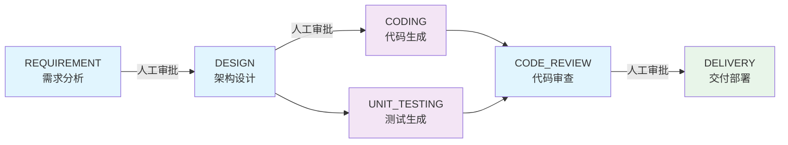

# OmniFlowAI

<p align="center">
  
  
  
  
  
</p>

<p align="center">
  <strong>AI 驱动的研发全流程引擎</strong><br>
  需求 → 设计 → 编码 → 测试 → 审查 → 交付，全流程自动化
</p>

***

## 🎯 项目简介

OmniFlowAI 是一个 AI 驱动的研发全流程引擎，将软件开发生命周期中的需求分析、架构设计、代码生成、测试验证、代码审查和交付部署整合为一条自动化 Pipeline。通过多 Agent 协作架构，实现 **"Pipeline 为骨架，Agent 为肌肉，人类为审查者"** 的人机协同开发模式。

### 核心特性

| 特性                 | 描述                                                                        |
| ------------------ | ------------------------------------------------------------------------- |
| 🤖 **多 Agent 协作**  | Architect、Designer、Coder、Tester、Reviewer、Repairer 六大 Agent 协同工作           |
| 🔄 **Pipeline 编排** | 六阶段固定流程：REQUIREMENT → DESIGN → CODING ∥ TESTING → CODE\_REVIEW → DELIVERY |
| 🧠 **人机协同**        | 关键节点人工审批（REQUIREMENT/DESIGN/CODE\_REVIEW），确保质量可控                          |
| 🛡️ **多层防御**       | 代码沙箱、契约验证、分层测试、自动修复，四层安全机制保障                                              |
| 🔌 **多模型支持**       | 支持 OpenAI、DeepSeek、MiMo 等多种 LLM 提供商，可动态切换                                 |
| 🌐 **浏览器注入**       | 支持直接在浏览器中选中元素进行 AI 代码修改，实时预览效果                                            |

***

## 🏗️ 架构概览

```
┌─────────────────────────────────────────────────────────────────┐
│                        Frontend (React 19)                       │
│  ┌─────────────┐  ┌─────────────┐  ┌─────────────────────────┐  │
│  │   Landing   │  │   Console   │  │    Pipeline Detail      │  │
│  │   Page      │  │   (Dashboard)│  │    (Visual Flow)        │  │
│  └─────────────┘  └─────────────┘  └─────────────────────────┘  │
│  ┌─────────────┐  ┌─────────────┐  ┌─────────────────────────┐  │
│  │  Workspace  │  │  Analytics  │  │   Browser Injector      │  │
│  │  (File Mgmt)│  │  (Metrics)  │  │   (Element Selection)   │  │
│  └─────────────┘  └─────────────┘  └─────────────────────────┘  │
└────────────────────────────┬────────────────────────────────────┘
                             │ HTTP/WebSocket/SSE
┌────────────────────────────▼────────────────────────────────────┐
│                      Backend (FastAPI)                           │
│  ┌─────────────────────────────────────────────────────────┐    │
│  │  API Layer (api/v1/)                                    │    │
│  │  ├── pipeline.py    - Pipeline CRUD & Execution         │    │
│  │  ├── system.py      - Health & Metrics                  │    │
│  │  ├── workspace.py   - File Operations                   │    │
│  │  └── code_modify.py - AI Code Modification              │    │
│  └─────────────────────────────────────────────────────────┘    │
│  ┌─────────────────────────────────────────────────────────┐    │
│  │  Service Layer (service/)                               │    │
│  │  ├── pipeline.py         - Pipeline Orchestration       │    │
│  │  ├── stage_handlers/     - Stage Strategy Pattern       │    │
│  │  ├── sandbox_orchestrator.py - Docker Sandbox Lifecycle │    │
│  │  └── repair_service.py   - Auto-repair Loop             │    │
│  └─────────────────────────────────────────────────────────┘    │
│  ┌─────────────────────────────────────────────────────────┐    │
│  │  Agent Layer (agents/) - LLM Interaction Only           │    │
│  │  ├── architect.py   - Requirement Analysis              │    │
│  │  ├── designer.py    - Contract Generation               │    │
│  │  ├── coder.py       - Code Generation                   │    │
│  │  ├── tester.py      - Test Generation                   │    │
│  │  ├── code_reviewer.py - 7-Dimension Review              │    │
│  │  └── repairer_with_tools.py - Multi-round Repair        │    │
│  └─────────────────────────────────────────────────────────┘    │
└────────────────────────────┬────────────────────────────────────┘
                             │ Docker API
┌────────────────────────────▼────────────────────────────────────┐
│                      Sandbox (Docker)                            │
│  ┌─────────────────────────────────────────────────────────┐    │
│  │  Isolated Execution Environment                         │    │
│  │  ├── Resource Limits: 1GB RAM, 2 CPUs                   │    │
│  │  ├── Temporary Directory Mount                          │    │
│  │  ├── Safe File I/O (base64 transport)                   │    │
│  │  └── Layered Test Execution                             │    │
│  └─────────────────────────────────────────────────────────┘    │
└─────────────────────────────────────────────────────────────────┘
```

***

## 🚀 快速开始

### 环境要求

- **Python** 3.11+
- **Node.js** 18+
- **Docker** Desktop (用于沙箱执行)
- **Git**

### 一键部署

#### Windows

```powershell
git clone https://github.com/sennemmi/OmniFlow-AI.git
cd feishutemp
.\deploy.bat
```

#### Linux / Mac

```bash
git clone https://github.com/sennemmi/OmniFlow-AI.git
cd feishutemp
chmod +x deploy.sh
./deploy.sh
```

### 手动部署

#### 1. 克隆仓库

```bash
git clone https://github.com/sennemmi/OmniFlow-AI.git
cd feishutemp
```

#### 2. 配置环境变量

```bash
cd backend
cp .env.template .env
# 编辑 .env 文件，配置 AI 模型 API 密钥和目标项目路径
```

#### 3. 构建 Sandbox 镜像

```bash
cd ..
docker build -f sandbox/Dockerfile -t omniflowai/sandbox:latest .
```

#### 4. 启动后端

```bash
cd backend
python -m venv .venv
source .venv/bin/activate  # Windows: .venv\Scripts\activate
pip install -r requirements.txt
python run_server.py
```

#### 5. 启动前端

```bash
cd frontend
npm install
npm run dev
```

### 访问服务

- **前端界面**: <http://localhost:5173>
- **后端 API**: <http://localhost:8000>
- **API 文档**: <http://localhost:8000/docs>

***

## 📋 Pipeline 生命周期



### 阶段说明

| 阶段                | Agent        | 说明                     | 人工审批 |
| ----------------- | ------------ | ---------------------- | ---- |
| **REQUIREMENT**   | Architect    | 分析需求，生成用户故事和验收标准       | ✅ 必需 |
| **DESIGN**        | Designer     | 生成接口契约 (InterfaceSpec) | ✅ 必需 |
| **CODING**        | Coder        | 基于契约生成实现代码             | ❌ 自动 |
| **UNIT\_TESTING** | Tester       | 基于契约生成单元测试             | ❌ 自动 |
| **CODE\_REVIEW**  | CodeReviewer | 7 维度代码审查               | ✅ 必需 |
| **DELIVERY**      | Delivery     | 创建 PR/MR，部署交付          | ❌ 自动 |

***

## 🤖 Agent 系统

### Agent 架构

每个 Agent 基于 **LangGraph 状态机**实现，包含三个核心节点：

```
┌─────────┐    ┌───────────┐    ┌─────────────┐
│ Process │───→│ Validate  │───→│ Retry / End │
│  (LLM)  │    │ (Check)   │    │ (Decision)  │
└─────────┘    └───────────┘    └─────────────┘
```

### Agent 列表

| Agent            | 职责   | 核心能力                             |
| ---------------- | ---- | -------------------------------- |
| **Architect**    | 需求分析 | 用户故事生成、验收标准定义、技术可行性评估            |
| **Designer**     | 架构设计 | 接口契约生成、数据模型设计、结构化输出 (Instructor) |
| **Coder**        | 代码生成 | Search/Replace 代码编辑、多文件协调、上下文感知  |
| **Tester**       | 测试生成 | 基于契约生成测试用例、边界条件覆盖                |
| **CodeReviewer** | 代码审查 | 7 维度评分 (功能/安全/性能/可读性/可维护性/测试/文档) |
| **Repairer**     | 自动修复 | 多轮修复循环、停滞检测、工具调用                 |

### 工具系统

Agent 通过标准化工具与系统交互：

```python
# 文件操作工具
read_chunk(file_path, offset, limit)     # 安全读取文件
glob(pattern)                            # 文件搜索
grep_ast(pattern, path)                  # AST 感知代码搜索

# 代码编辑工具
search_block(file_path, old_string)      # 精确代码定位
replace_block(file_path, old, new)       # 原子性代码替换
code_apply(files)                        # 批量代码应用

# 知识工具
semantic_search(query, top_k)            # 语义代码搜索
```

***

## 🛡️ 安全机制

### 四层防御体系

```
┌─────────────────────────────────────────┐
│  Layer 1: Code Sandbox                  │
│  - Docker 隔离执行                      │
│  - 临时目录挂载                         │
│  - 资源限制 (1GB RAM, 2 CPUs)           │
└─────────────────────────────────────────┘
┌─────────────────────────────────────────┐
│  Layer 2: Contract Alignment            │
│  - Designer ↔ Coder ↔ Tester 契约验证   │
│  - InterfaceSpec 作为单一事实来源       │
└─────────────────────────────────────────┘
┌─────────────────────────────────────────┐
│  Layer 3: Layered Testing               │
│  - L1: Sandbox 启动测试                 │
│  - L2: Import 语法检查                  │
│  - L3: 单元测试执行                     │
│  - L4: 集成测试验证                     │
│  - L5: 契约一致性检查                   │
└─────────────────────────────────────────┘
┌─────────────────────────────────────────┐
│  Layer 4: Auto-Repair Loop              │
│  - 最大 3 轮自动修复                    │
│  - 停滞检测 (无进展自动终止)            │
│  - 防御层破坏时强制人工介入             │
└─────────────────────────────────────────┘
```

***

## 🔧 配置指南

### AI 模型配置

支持多种 LLM 提供商，通过环境变量切换：

```ini
# .env 文件
LLM_PROVIDER=deepseek  # 可选: openai | mimo | deepseek

# DeepSeek 配置 (推荐)
DEEPSEEK_API_KEY=sk-your-api-key
DEEPSEEK_DEFAULT_MODEL=deepseek-chat  # 或 deepseek-reasoner

# OpenAI 配置
OPENAI_API_KEY=sk-your-api-key
OPENAI_API_BASE=https://api.openai.com/v1

# MiMo 配置
MIMO_API_KEY=your-api-key
MIMO_API_BASE=https://api.xiaomimimo.com/v1
```

### 目标项目配置

```ini
# AI 操作的目标项目绝对路径
TARGET_PROJECT_PATH=/absolute/path/to/your/project
```

详细配置说明请参考 [backend/ENV\_CONFIG.md](backend/ENV_CONFIG.md)

***

## 📚 API 文档

OmniFlowAI 提供完整的 RESTful API，所有 API 返回统一响应格式：

```json
{
  "success": true,
  "data": { ... },
  "error": null,
  "request_id": "uuid-string"
}
```

### Pipeline API

| 方法       | 端点                                          | 说明                 |
| -------- | ------------------------------------------- | ------------------ |
| `POST`   | `/api/v1/pipeline/create`                   | 创建新的 Pipeline      |
| `GET`    | `/api/v1/pipeline/{id}/status`              | 获取 Pipeline 状态     |
| `GET`    | `/api/v1/pipeline/{id}/diff`                | 获取 CODING 阶段完整代码变更 |
| `GET`    | `/api/v1/pipeline/{id}/logs`                | SSE 实时日志流          |
| `GET`    | `/api/v1/pipelines`                         | 列出所有 Pipeline      |
| `POST`   | `/api/v1/pipeline/{id}/approve`             | 审批 Pipeline        |
| `POST`   | `/api/v1/pipeline/{id}/reject`              | 驳回 Pipeline        |
| `POST`   | `/api/v1/pipeline/{id}/approve-code-review` | 审批 CODE\_REVIEW 阶段 |
| `POST`   | `/api/v1/pipeline/{id}/terminate`           | 终止 Pipeline        |
| `POST`   | `/api/v1/pipeline/{id}/retry`               | 重试失败的 Pipeline     |
| `POST`   | `/api/v1/pipeline/{id}/test-decision`       | 测试冲突决策             |
| `POST`   | `/api/v1/pipeline/{id}/override-test`       | 人工覆盖测试代码           |
| `DELETE` | `/api/v1/pipeline/{id}`                     | 删除 Pipeline        |

### System API

| 方法    | 端点                               | 说明         |
| ----- | -------------------------------- | ---------- |
| `GET` | `/api/v1/health`                 | 基础健康检查     |
| `GET` | `/api/v1/system/stats`           | 获取系统统计信息   |
| `GET` | `/api/v1/system/health`          | 获取系统健康状态   |
| `GET` | `/api/v1/system/metrics`         | 获取系统资源使用指标 |
| `GET` | `/api/v1/system/health-detailed` | 综合健康检查     |
| `GET` | `/api/v1/system/db-status`       | 检查数据库连接状态  |
| `GET` | `/api/v1/system/config`          | 获取系统配置     |
| `GET` | `/api/v1/system/analytics`       | 获取系统分析统计   |

### Workspace API

| 方法     | 端点                                | 说明      |
| ------ | --------------------------------- | ------- |
| `GET`  | `/api/v1/workspace/files`         | 获取文件树结构 |
| `GET`  | `/api/v1/workspace/files/content` | 获取文件内容  |
| `POST` | `/api/v1/workspace/files/content` | 保存文件内容  |
| `GET`  | `/api/v1/workspace/stats`         | 获取工作区统计 |

### Code Modify API

| 方法     | 端点                             | 说明        |
| ------ | ------------------------------ | --------- |
| `POST` | `/api/v1/code/modify`          | 轻量级代码修改   |
| `POST` | `/api/v1/code/modify-batch`    | 批量代码修改    |
| `GET`  | `/api/v1/code/file-content`    | 获取文件内容    |
| `PUT`  | `/api/v1/code/file-content`    | 更新文件内容    |
| `POST` | `/api/v1/code/create-mr`       | 创建轻量 MR   |
| `POST` | `/api/v1/code/create-mr-batch` | 创建批量轻量 MR |

### API 详细文档

启动服务后访问 Swagger UI：<http://localhost:8000/docs>

***

## 🧪 测试

### 运行测试

```bash
# 后端单元测试
cd backend
python -m pytest tests/unit -v

# 防御测试 (免疫系统)
python -m pytest tests/unit/defense -v

# 前端单元测试
cd frontend
npm run test

# E2E 测试 (需要前后端服务运行)
npx playwright test
```

### Makefile 快捷命令

```bash
make test-be-unit      # 后端单元测试
make test-be-ci        # 后端单元 + 集成测试
make test-fe-unit      # 前端单元测试
make test-smoke        # 快速冒烟测试
make test-e2e          # E2E 测试
make test-all          # 全部测试
```

***

## 📁 项目结构

```
omniflowai/
├── backend/                    # FastAPI 后端
│   ├── app/
│   │   ├── api/v1/            # API 路由
│   │   ├── service/           # 业务逻辑层
│   │   │   └── stage_handlers/ # 阶段处理器
│   │   ├── agents/            # AI Agent 实现
│   │   ├── core/              # 核心组件
│   │   └── models/            # 数据模型
│   ├── tests/                 # 测试用例
│   ├── .env.template          # 环境变量模板
│   └── ENV_CONFIG.md          # 配置文档
├── frontend/                   # React 前端
│   ├── src/
│   │   ├── components/        # React 组件
│   │   ├── pages/             # 页面组件
│   │   ├── injector/          # 浏览器注入脚本
│   │   └── stores/            # Zustand 状态管理
│   └── package.json
├── sandbox/                    # Docker 沙箱
│   ├── Dockerfile
│   └── requirements-sandbox.txt
├── tests/                      # 跨模块测试
├── deploy.bat                  # Windows 部署脚本
├── deploy.sh                   # Linux/Mac 部署脚本
└── README.md                   # 本文件
```

***

## 🤝 贡献指南

我们欢迎社区贡献！请遵循以下步骤：

1. **Fork 仓库** 并创建您的特性分支
2. **遵循代码规范** - 请参考 [CONVENTIONS.md](CONVENTIONS.md)
3. **编写测试** - 确保新功能有对应的测试覆盖
4. **提交 PR** - 描述清楚改动内容和测试情况

### 代码规范

- 使用 `app.` 前缀导入模块
- 通过 `Depends(get_session)` 注入数据库会话
- 使用 `structlog` 记录日志，不使用 `print()`
- API 响应使用 `success_response` / `error_response`

***

## 📄 许可证

[MIT License](LICENSE)

***

## 🙏 致谢

- [LangGraph](https://github.com/langchain-ai/langgraph) - Agent 工作流编排
- [FastAPI](https://fastapi.tiangolo.com/) - 高性能 Web 框架
- [React Flow](https://reactflow.dev/) - Pipeline 可视化
- [Monaco Editor](https://microsoft.github.io/monaco-editor/) - 代码编辑器

***

<p align="center">
  Made with ❤️ by OmniFlowAI Team
</p>
